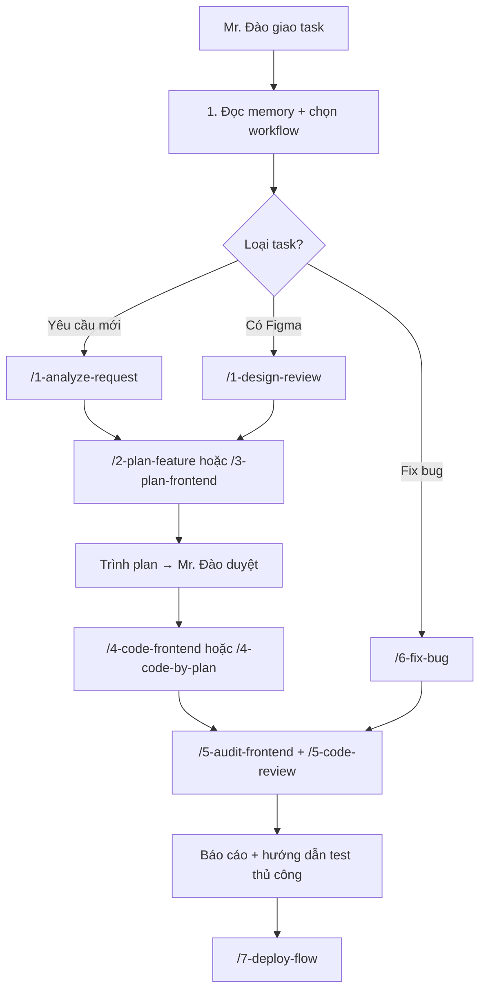

# 🤖 AGENT — Bộ Não & Quy Trình Làm Việc cho Dev Frontend

> **Phiên bản:** v1.0 | **Cập nhật:** 2026-05-16
>
> **Đối tượng:** Dev Frontend làm việc trên dự án `web-lifestyle` của IruKa.

---

## 🚨 QUY TẮC TỐI QUAN TRỌNG — ĐỌC TRƯỚC TIÊN

### 1. KHÔNG được tạo workflow/rule mới

Toàn bộ workflow trong thư mục này đã được **Mr. Đào chốt sẵn**. Dev FE **CHỈ ĐƯỢC**:
- ✅ Đọc và áp dụng đúng theo workflow có sẵn
- ✅ Đề xuất bổ sung/sửa workflow → **Mr. Đào duyệt** mới được sửa
- ❌ **TUYỆT ĐỐI KHÔNG** tự ý tạo file workflow mới trong `workflows/`
- ❌ **TUYỆT ĐỐI KHÔNG** tự ý sửa nội dung workflow đã có

### 2. KHÔNG được tự đổi tech stack

Mọi thư viện, framework, công cụ đã chốt trong `TECH_STACK.md` (file ở thư mục gốc). Muốn thêm thư viện ngoài danh sách → hỏi Mr. Đào.

### 3. Đầu mỗi conversation phải làm Startup Checklist

```
1. Đọc memory/lessons-learned.md → nhớ lỗi cũ đã mắc
2. Đọc memory/anti-patterns.md → nhớ điều cấm
3. Đọc memory/useful-commands.md → nhớ lệnh hay dùng
4. Đọc memory/kaizen.md → nhớ best practice
5. Xác định workflow phù hợp từ workflows/0-gate.md
6. Khai báo ở đầu response: 📋 Workflow: /[tên] | 📖 Memory: đã đọc
```

---

## 📂 Cấu trúc thư mục

```
agent/
├── README.md                ← File này (đọc đầu tiên)
├── GEMINI.md                ← Rules toàn cục cho FE (bộ não cứng)
│
├── workflows/               ← Quy trình làm việc — CHỐT SẴN, KHÔNG ĐƯỢC TẠO MỚI
│   ├── 0-*.md               ← Layer 0: Meta & Gate (5 file)
│   ├── 1-*.md               ← Layer 1: Analyze & Spec (7 file)
│   ├── 2-*.md               ← Layer 2: Planning (4 file)
│   ├── 3-*.md               ← Layer 3: Tech Design (6 file)
│   ├── 4-*.md               ← Layer 4: Execution (10 file)
│   ├── 5-*.md               ← Layer 5: QA & Audit (11 file)
│   ├── 6-*.md               ← Layer 6: Fix & Revert (5 file)
│   ├── 7-*.md               ← Layer 7: Ops & Performance (3 file)
│   ├── 9-*.md               ← Layer 9: Sync & Learn
│   └── report-to-discord.md, rv.md
│
└── memory/                  ← Bộ nhớ & học hỏi — FE dev được append vào
    ├── readme.md            ← Hướng dẫn cách dùng memory
    ├── anti-patterns.md     ← Điều CẤM (FE chỉ append nếu Mr. Đào duyệt)
    ├── lessons-learned.md   ← Log lỗi cũ + cách fix (FE chỉ append nếu Mr. Đào duyệt)
    ├── kaizen.md            ← Best practice (FE chỉ append nếu Mr. Đào duyệt)
    ├── useful-commands.md   ← Lệnh shell hay dùng
    ├── frontend-layout-techniques.md ← 🎯 KIẾN THỨC FE CHUYÊN SÂU
    ├── debug_url_param_guide.md ← Cách dùng debug URL param
    ├── sticky-table-rows-cols.md ← Pattern table sticky header
    ├── improvements/        ← Cải tiến workflow theo thời gian
    └── ideas/               ← Ý tưởng (chưa duyệt)
```

---

## 🗺️ Bảng tra Workflow theo loại task

| Tình huống | Workflow nên dùng |
|---|---|
| Nhận yêu cầu mới, tính năng mới | `/1-analyze-request` |
| Trước khi code mới — kiểm tra đã có gì tái sử dụng được không | `/1-analyze-reuse` |
| Có Figma/mockup cần review | `/1-design-review` |
| Lên kế hoạch tính năng từ ý tưởng → task list | `/2-plan-feature` |
| Lên kế hoạch từ mockup HTML | `/2-plan-from-mockup` |
| Lên kế hoạch UI/UX chuyên nghiệp | `/3-plan-ui&ux` |
| Lên kế hoạch frontend triển khai | `/3-plan-frontend` |
| Thiết kế design system core (token/component) | `/3-design-system-core` |
| Viết spec mockup đầy đủ cho dev khác | `/3-mockup-spec` |
| Hiệu chỉnh UI responsive cho nhiều màn | `/3-calibrate-ui-responsive` |
| Code UI mới theo plan | `/4-code-frontend` hoặc `/4-code-ui&ux` |
| Code theo yêu cầu nhỏ | `/4-code-flow-request` |
| Code nghiêm kỷ theo plan đã duyệt | `/4-code-by-plan` |
| Đắp Figma vào logic có sẵn | `/4-figma-to-ui` |
| Code UI từ mockup HTML, đảm bảo pixel perfect | `/4-frontend-mockup-fidelity` |
| Tinh chỉnh UI ("polish", "fine-tune", "đẹp hơn") | `/4-refine-ui-pro` |
| Đảm bảo chuyển màn liền mạch | `/4-cross-screen-flow` |
| Thêm debug URL param để xem nhanh màn hình | `/4-debug-preview` |
| Audit toàn bộ frontend của 1 tính năng | `/5-audit-frontend` |
| Audit luồng button | `/5-audit-button-flow` |
| Audit chuyển màn | `/5-audit-cross-screen` |
| Audit logic toàn bộ tính năng | `/5-audit-logic` |
| Audit code review trước merge | `/5-code-review` |
| Audit bảo mật frontend (XSS, CSP...) | `/5-security-frontend` |
| Viết test thủ công | `/5-test-manual` |
| Viết test tự động | `/5-test-auto` |
| Fix bug giao diện | `/6-fix-bug` hoặc `/6-bugfix` |
| Sửa lệch UI so với design | `/6-fix-design-fidelity` |
| Hoàn tác code (revert) | `/6-revert-code-iruka` |
| Deploy lên staging/prod | `/7-deploy-flow` |
| Tối ưu hiệu năng FE | `/7-optimize-fe` |
| Báo cáo task lên Discord | `/report-to-discord` |
| Review cuối ngày 17h30 | `/rv` |

---

## 📋 Quy trình chuẩn cho 1 task FE điển hình



---

## 🧠 Memory — Khi nào & cách dùng

### Khi cần ĐỌC memory

- Đầu mỗi conversation (bắt buộc 4 file trên trong Startup Checklist)
- Trước khi code 1 pattern → check `frontend-layout-techniques.md` xem đã có hướng dẫn chưa
- Khi cần dùng debug URL → đọc `debug_url_param_guide.md`
- Khi làm bảng table phức tạp → đọc `sticky-table-rows-cols.md`

### Khi cần GHI memory

> ⚠️ **FE dev KHÔNG được tự append vào memory.** Phải:
>
> 1. Draft nội dung theo format chuẩn (xem `memory/readme.md`)
> 2. Báo Mr. Đào: "Em phát hiện bài học này, anh duyệt thì em lưu vào memory"
> 3. Mr. Đào OK → mới được append

### Format draft bài học (lessons-learned)

```markdown
## [YYYY-MM-DD] Tên bài học

**Bối cảnh:** [Đang làm gì, ở đâu]

**Lỗi đã xảy ra:**
- [Mô tả lỗi cụ thể]

**Root cause (nguyên nhân gốc):**
- [Tại sao lỗi]

**Cách fix:**
- [Bước 1]
- [Bước 2]

**Phòng ngừa lần sau:**
- [Quy tắc rút ra]
```

---

## 🎓 Mr. Đào ưu tiên dev FE đọc 4 file này NHẤT

1. **`GEMINI.md`** (file rules toàn cục — kiêm "bộ não cứng")
2. **`memory/frontend-layout-techniques.md`** (1066 dòng kiến thức FE chuyên sâu — Big Tech best practice)
3. **`workflows/0-gate.md`** (cách chọn workflow đúng)
4. **`workflows/0-scope-execution.md`** (cách chia scope khi task lớn)

---

## ❓ FAQ cho FE Dev

**Q: Tôi muốn dùng thư viện X chưa có trong stack, làm sao?**
A: Hỏi Mr. Đào trước. Không tự ý cài.

**Q: Tôi thấy workflow này thiếu bước Y, sửa được không?**
A: Không. Mở 1 PR đề xuất hoặc nhắn Mr. Đào để duyệt.

**Q: Có bug lạ chưa từng gặp, làm sao?**
A: Theo workflow `/6-fix-bug`. Sau khi fix xong, draft bài học để Mr. Đào duyệt lưu vào memory.

**Q: Task quá lớn, làm 1 lần không xong?**
A: Bắt buộc theo `/0-scope-execution` — chia 2-4 scope, trình kế hoạch, làm tuần tự, báo cáo sau mỗi scope.

**Q: Đặt câu hỏi quá nhiều có sao không?**
A: Mỗi lần hỏi tối đa 2-3 câu, đi thẳng vào vấn đề. Với task rõ ràng → tự quyết và làm luôn.

---

## 📞 Liên hệ

- **Chủ dự án:** Mr. Đào (CEO IruKa) — Vibe Coder, **không biết code** → giải thích bằng ngôn ngữ người thường, Việt hoá thuật ngữ.
- **Tham khảo dự án anh em:** `iruka_news/guest`, `iruka-app/`

---

_Tài liệu này là **luật chơi** trong dự án. Vi phạm = phải làm lại task._
