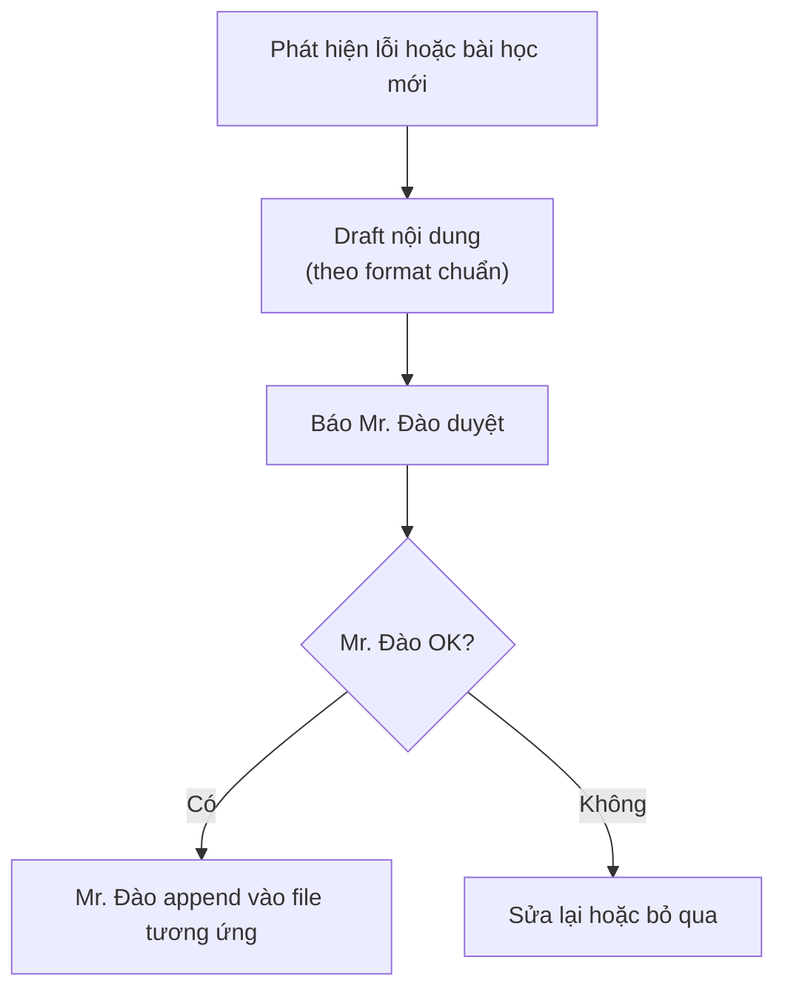

# 🧠 Memory System — Web Lifestyle (FE Only)

> Hệ thống ghi nhớ và tự cải tiến cho AI Agent / FE Dev khi làm dự án `web-lifestyle`.
>
> Đọc file này TRƯỚC KHI bắt đầu conversation để không lặp lỗi cũ và áp dụng best practice.

---

## 📁 Cấu trúc thư mục

```
agent/memory/
├── readme.md                       ← File này — hướng dẫn tổng quan
├── lessons-learned.md              ← Log lỗi đã gặp + cách fix (DUYỆT bởi Mr. Đào)
├── anti-patterns.md                ← Những gì KHÔNG BAO GIỜ được làm
├── kaizen.md                       ← Best Practice & Pattern thông minh
├── useful-commands.md              ← Lệnh shell + snippet hay dùng
├── frontend-layout-techniques.md   ← 🎯 Kiến thức FE chuyên sâu (Big Tech)
├── debug_url_param_guide.md        ← Cách dùng debug URL param xem nhanh màn hình
├── sticky-table-rows-cols.md       ← Pattern bảng sticky header + frozen columns
├── improvements/                   ← Đề xuất cải tiến workflow theo thời gian
└── ideas/                          ← Ý tưởng chưa duyệt
```

---

## 📖 Quy trình đọc khi bắt đầu task

Mỗi conversation mới, AI Agent / FE Dev PHẢI:

1. ✅ Đọc `lessons-learned.md` → nhớ những lỗi đã mắc
2. ✅ Đọc `anti-patterns.md` → nhớ những gì không được làm
3. ✅ Đọc `kaizen.md` → nạp Best Practice
4. ✅ Đọc `useful-commands.md` → nhớ lệnh hay dùng
5. ✅ Quét `frontend-layout-techniques.md` nếu đang làm UI/layout
6. ✅ Kiểm tra `improvements/` nếu liên quan đến workflow đang dùng

---

## 🔄 Quy trình khi phát hiện lỗi / bài học mới



> ⚠️ **FE Dev TUYỆT ĐỐI KHÔNG được tự append vào memory.** Phải qua duyệt.

---

## 📝 Format chuẩn

### Bài học (lessons-learned.md)

```markdown
### [FE-XX] Tên bài học ngắn gọn

- **ID:** FE-XX (số tăng dần)
- **Domain:** UI / State / Performance / SEO / A11Y / Form / Animation / ...
- **Ngày:** YYYY-MM-DD
- **AI Agent đã làm:** [Claude / Cursor / ...]
- **Trạng thái:** Active

**Bối cảnh:** [Đang làm tính năng gì]

**Lỗi đã xảy ra:** [Mô tả lỗi]

**Root cause:** [Nguyên nhân gốc]

**Cách fix:**
1. [Bước 1]
2. [Bước 2]

**Phòng ngừa:**
- [Quy tắc rút ra]

**Liên quan workflow:** /[tên-workflow]
```

### Kaizen (kaizen.md)

```markdown
### [K-FE-XX] Tên gọi ngắn — mô tả phong cách

- **Domain:** Lĩnh vực áp dụng
- **Đúc kết từ:** Mô tả ngắn task gốc

**Pattern chuẩn / Trick hay:**
[Mô tả kỹ thuật/cách làm thông minh hơn]

**Lý do:** [Tại sao cách này tốt hơn cách cũ]
```

### Anti-pattern (anti-patterns.md)

```markdown
| AP-XXX | [Mô tả ngắn anti-pattern] | [Lý do tại sao xấu] | [Thay bằng cách nào] |
```

---

## 🎯 4 file vàng FE Dev đọc NHẤT

1. **`frontend-layout-techniques.md`** — 1066 dòng kiến thức FE chuyên sâu (Big Tech best practice)
2. **`useful-commands.md`** — Lệnh + snippet copy-paste là chạy
3. **`anti-patterns.md`** — Đọc trước khi code để không phạm lỗi cấm
4. **`debug_url_param_guide.md`** — Trick xem nhanh màn hình khi dev

---

## 🚫 KHÔNG được làm gì với memory

- ❌ Tự append vào lessons-learned / kaizen / anti-patterns khi chưa được Mr. Đào duyệt
- ❌ Sửa nội dung cũ (chỉ Mr. Đào sửa)
- ❌ Xoá nội dung cũ — kể cả khi nghĩ nó hết relevant
- ❌ Copy nội dung từ dự án khác (BE, Game, Discord) vào đây — file này CHỈ DÀNH CHO FE web-lifestyle

---

*Phiên bản: v1.0-FE | Cập nhật: 2026-05-16 | Web Lifestyle Memory System*
