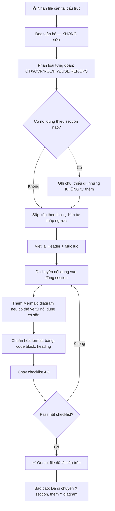

# /1-restructure-docs — Workflow Tái Cấu Trúc Tài Liệu

## 🎯 Mục tiêu
Nhận vào 1 file tài liệu bất kỳ (BA, plan, guide, README...) → **Không xóa, không thêm nội dung** → Chỉ sắp xếp lại để:
- Người đọc lần đầu không bị overwhelm
- Từ "big picture" → chi tiết → thực hành
- Dễ tìm kiếm khi cần tra lại
- Dễ thuộc vì có cấu trúc logic nhất quán

---

## 📥 BƯỚC 1 — Đọc & Phân loại nội dung hiện có

**Đọc toàn bộ file trước, KHÔNG sửa gì.** Sau đó phân loại từng đoạn vào 1 trong 7 nhóm:

| Nhóm | Ký hiệu | Chứa loại nội dung |
|------|---------|-------------------|
| Context | `[CTX]` | Lý do tạo tài liệu, bối cảnh, vấn đề cần giải quyết |
| Overview | `[OVR]` | Tổng quan hệ thống, kiến trúc, mục tiêu |
| Roles | `[ROL]` | Ai dùng, ai vận hành, phân quyền |
| How-it-works | `[HIW]` | Cơ chế, luồng xử lý, logic bên trong |
| Usage | `[USE]` | Hướng dẫn sử dụng, lệnh, ví dụ thực tế |
| Reference | `[REF]` | Bảng config, env vars, danh sách ID/key |
| Ops | `[OPS]` | Vận hành, deploy, backup, xử lý lỗi |

> ❗ Mỗi đoạn chỉ thuộc 1 nhóm. Nếu 1 section chứa nhiều nhóm → tách ra.

---

## 🗺️ BƯỚC 2 — Xác định thứ tự sắp xếp

Áp dụng nguyên tắc **"Kim tự tháp ngược"**: Từ rộng → hẹp dần:

```
┌─────────────────────────────────────────────────┐
│  1. BỐI CẢNH     [CTX]  — Tại sao file này tồn tại?     │
├─────────────────────────────────────────────────┤
│  2. TỔNG QUAN    [OVR]  — Hệ thống là gì?                │
├─────────────────────────────────────────────────┤
│  3. AI DÙNG      [ROL]  — Phân vai, phân quyền          │
├─────────────────────────────────────────────────┤
│  4. CƠ CHẾ       [HIW]  — Nó hoạt động thế nào?         │
├─────────────────────────────────────────────────┤
│  5. SỬ DỤNG      [USE]  — Làm cụ thể từng bước          │
├─────────────────────────────────────────────────┤
│  6. THAM CHIẾU   [REF]  — Bảng tra cứu nhanh            │
├─────────────────────────────────────────────────┤
│  7. VẬN HÀNH     [OPS]  — Deploy, lỗi, backup           │
└─────────────────────────────────────────────────┘
```

**Quy tắc ưu tiên trong mỗi nhóm:**
- Thông tin CHUNG trước → RIÊNG sau
- Thông tin THƯỜNG DÙNG trước → HIẾM DÙNG sau
- Happy path trước → Edge case sau

---

## ✂️ BƯỚC 3 — Tái cấu trúc từng phần

### 3.1 Viết lại Header (đầu file)

```markdown
# [Icon] Tên Tài Liệu — Mô tả ngắn 1 dòng

> **Phiên bản:** v[X.Y] | **Cập nhật:** [YYYY-MM-DD]
> **Người duyệt:** [Tên] | **Trạng thái:** ✅ Hoàn chỉnh / 🚧 Đang cập nhật
> **Đối tượng đọc:** [CEO / Dev / Nhân viên vận hành]
```

### 3.2 Viết Mục lục (Table of Contents)

```markdown
## 📑 Mục lục

1. [Bối cảnh & Mục tiêu](#1-bối-cảnh--mục-tiêu)
2. [Tổng quan hệ thống](#2-tổng-quan-hệ-thống)
3. [Phân vai & Quyền hạn](#3-phân-vai--quyền-hạn)
4. [Cơ chế hoạt động](#4-cơ-chế-hoạt-động)
5. [Hướng dẫn sử dụng](#5-hướng-dẫn-sử-dụng)
6. [Bảng tham chiếu](#6-bảng-tham-chiếu)
7. [Vận hành & Bảo trì](#7-vận-hành--bảo-trì)
```

### 3.3 Nguyên tắc sắp xếp nội dung trong mỗi section

**Section TỔNG QUAN:**
```
1. Bài toán đang giải quyết (Context)
2. Giải pháp là gì (Solution overview)
3. Diagram kiến trúc (1 Mermaid graph)
4. Danh sách tính năng chính (bullet list ngắn)
```

**Section CƠ CHẾ:**
```
1. Luồng chính (Happy path) — sequenceDiagram hoặc flowchart
2. Luồng phụ (các trường hợp đặc biệt)
3. Giải thích từng component (ngắn gọn, link sang section chi tiết)
```

**Section SỬ DỤNG:**
```
1. Quick Start — làm được ngay trong 5 phút
2. Hướng dẫn chi tiết từng tính năng
3. Ví dụ thực tế (input → output)
4. Bảng lệnh đầy đủ
```

**Section THAM CHIẾU:**
```
1. Biến môi trường (.env)
2. Danh sách ID / Key / Channel
3. Config mặc định
```

**Section VẬN HÀNH:**
```
1. Khởi động / Tắt
2. Kiểm tra trạng thái
3. Xử lý lỗi thường gặp (bảng)
4. Backup & Recovery
5. Liên hệ khi cần hỗ trợ
```

---

## 🔍 BƯỚC 4 — Kiểm tra chất lượng sau tái cấu trúc

### 4.1 Test "5 giây đầu tiên"
> Đọc chỉ title + subtitle + 3 dòng đầu mỗi section → Phải hiểu được cấu trúc tổng thể

### 4.2 Test "Tìm kiếm nhanh"
> Nếu muốn tra "Cách xử lý khi bot không online" → Phải tìm thấy trong ≤ 2 bước

### 4.3 Checklist cấu trúc

```
□ File có header rõ ràng: tên, version, ngày, người duyệt không?
□ Có mục lục với link nội bộ không?
□ Thứ tự: Tổng quan → Cơ chế → Sử dụng → Tham chiếu → Vận hành không?
□ Không có section nào bị lặp nội dung không?
□ Mỗi section có heading rõ ràng (##, ###) không?
□ Mỗi diagram có chú thích không?
□ Bảng có header row và căn chỉnh đẹp không?
□ Code block có được chỉ rõ language không? (```bash, ```json...)
□ Không có section nào quá dài (>500 chữ) mà không có sub-section không?
□ Cuối file có footer: ai viết, ai duyệt, liên hệ khi cần không?
```

---

## 🔄 BƯỚC 5 — Quy trình thực hiện cụ thể



---

## ⚠️ Nguyên tắc KHÔNG VI PHẠM

```
❌ KHÔNG thêm thông tin mới (chỉ tái cấu trúc, không viết thêm)
❌ KHÔNG xóa bất kỳ nội dung nào
❌ KHÔNG thay đổi ý nghĩa của câu, chỉ đổi vị trí
❌ KHÔNG tự ý rename section nếu tên gốc đã rõ ràng
✅ CHỈ: Di chuyển, nhóm lại, thêm heading, thêm diagram từ nội dung có sẵn
✅ CHỈ: Chuẩn hóa format (bảng, code block, emoji heading nhất quán)
✅ CHỈ: Thêm mục lục và liên kết nội bộ
```

---

## 📌 Báo cáo sau khi hoàn thành

Sau khi tái cấu trúc xong, báo cáo ngắn gọn:

```
✅ XONG: Tái cấu trúc [tên file]
📁 File: [đường dẫn]
📊 Thay đổi:
  - Số section cũ → mới: [X] → [Y]
  - Di chuyển: [mô tả ngắn những gì đã đổi chỗ]
  - Thêm: Mục lục, Header chuẩn, [N] Mermaid diagram từ nội dung có sẵn
  - Format: Chuẩn hóa [M] bảng, [P] code block
⚠️ Lưu ý: [Phát hiện thiếu gì không? Đề xuất bổ sung sau?]
```
