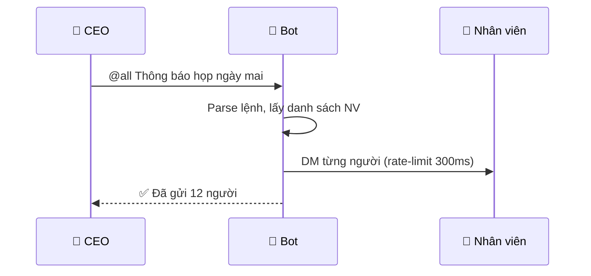

# /1-write-docs — Workflow Viết Tài Liệu Kỹ Thuật Chuẩn IruKa

## 🎯 Mục tiêu
Tạo ra một tài liệu hướng dẫn:
- Đọc là hiểu ngay, không cần hỏi thêm
- Có đủ: tổng quan → chi tiết → ví dụ → xử lý lỗi
- Chuẩn Markdown + Mermaid, hiển thị đẹp trên GitHub / Notion / VSCode

---

## 📋 BƯỚC 1 — Thu thập thông tin đầu vào

Trước khi viết, hỏi hoặc tự xác định:

| Câu hỏi | Mục đích |
|---------|---------|
| Tài liệu viết cho **ai**? (dev, nhân viên không biết code, CEO...) | Chọn ngôn ngữ & độ sâu kỹ thuật |
| **Mục tiêu** đọc xong họ làm được gì? | Xác định scope & kết quả kỳ vọng |
| Đây là **loại** gì? (tính năng mới, module, API, quy trình...) | Chọn template phù hợp |
| Có **code/flow/diagram** nào cần giải thích không? | Chuẩn bị Mermaid diagram |
| Tài liệu có **cập nhật định kỳ** không? | Thêm section "Changelog" nếu cần |

---

## 📐 BƯỚC 2 — Chọn Template theo loại tài liệu

### Template A — Hướng dẫn Tính năng / Module
Dùng khi: giới thiệu 1 tính năng cụ thể (ví dụ: "Broadcast Bot")

```
# 🎯 [Tên tính năng] — Hướng dẫn sử dụng

## 1. Tổng quan
   - Tính năng này làm gì?
   - Ai dùng? Dùng khi nào?
   - Lợi ích mang lại

## 2. Kiến trúc / Cơ chế hoạt động (Mermaid diagram)

## 3. Cài đặt & Cấu hình (nếu cần)

## 4. Cách sử dụng — từng bước
   - Bước 1: ...
   - Bước 2: ...
   - Ví dụ thực tế (input → output)

## 5. Bảng lệnh / Tham số đầy đủ

## 6. Xử lý lỗi thường gặp
   | Lỗi | Nguyên nhân | Cách fix |

## 7. Lưu ý & Giới hạn

## 8. Changelog
```

### Template B — Hướng dẫn Quy trình / Luồng làm việc
Dùng khi: mô tả một workflow (ví dụ: "Quy trình onboarding nhân viên")

```
# 🔄 [Tên quy trình] — Hướng dẫn thực hiện

## 1. Mục tiêu quy trình
## 2. Ai tham gia? (Roles & Responsibilities)
## 3. Điều kiện bắt đầu (Trigger)
## 4. Sơ đồ luồng (Mermaid flowchart/sequenceDiagram)
## 5. Các bước thực hiện chi tiết
## 6. Kết quả kỳ vọng (Definition of Done)
## 7. Ngoại lệ & Xử lý sự cố
```

### Template C — Tài liệu API / Kỹ thuật
Dùng khi: mô tả API endpoint, SDK function, database schema

```
# ⚙️ [Tên API/Module] — Technical Reference

## 1. Tổng quan
## 2. Authentication & Cấu hình
## 3. Endpoints / Functions (bảng đầy đủ)
## 4. Request / Response Schema (JSON example)
## 5. Error Codes
## 6. Rate Limits & Giới hạn
## 7. Ví dụ tích hợp (code snippet)
## 8. Changelog
```

---

## ✍️ BƯỚC 3 — Quy tắc viết nội dung

### 3.1 Ngôn ngữ theo đối tượng

| Đối tượng | Phong cách |
|----------|-----------|
| CEO / Manager | Kết quả trước, cơ chế sau. Dùng ví dụ thực tế. Không dùng thuật ngữ code |
| Nhân viên không code | "Bạn làm X → Bot sẽ Y". Có ví dụ copy-paste được |
| Developer | Ngắn gọn, technical. Code snippet đầy đủ. Type & interface rõ ràng |

### 3.2 Cấu trúc 1 bước hướng dẫn

```markdown
### Bước N: [Tên bước ngắn gọn]

**Mục đích:** [1 câu giải thích TẠI SAO cần bước này]

**Cách làm:**
1. [Hành động cụ thể, dùng động từ]
2. [Tiếp theo...]

**Ví dụ:**
```
[Input thực tế]
→ [Output thực tế]
```

**⚠️ Lưu ý:** [Nếu có edge case hoặc cạm bẫy]
```

### 3.3 Quy tắc Mermaid — chọn đúng loại diagram

| Muốn mô tả | Dùng loại Mermaid |
|-----------|------------------|
| Luồng xử lý (if/else, decision) | `flowchart LR` hoặc `flowchart TD` |
| Tương tác giữa các bên (A gửi B, B trả lại A) | `sequenceDiagram` |
| Quan hệ giữa components / modules | `graph LR` |
| Trạng thái của 1 object | `stateDiagram-v2` |
| Timeline sự kiện | `timeline` |
| Cấu trúc dữ liệu / class | `classDiagram` |
| Kế hoạch theo thời gian | `gantt` |

**Mermaid best practice:**
```markdown

```
- Label participant bằng tên dễ hiểu (không dùng A, B, C)
- Dùng `-->>` cho phản hồi, `--x` cho lỗi
- Thêm `Note over X,Y: Giải thích` cho context phức tạp

### 3.4 Bảng tham số / lệnh — format chuẩn

```markdown
| Lệnh / Tham số | Kiểu | Bắt buộc | Mô tả | Ví dụ |
|---------------|------|----------|-------|-------|
| `@all` | string | ✅ | Broadcast toàn team | `@all Họp 9h` |
| `@all-dm` | string | ❌ | Chỉ DM, không đăng kênh | `@all-dm Nhắc nộp báo cáo` |
```

### 3.5 Section Xử lý lỗi — format chuẩn

```markdown
## ❌ Xử lý lỗi thường gặp

| Triệu chứng | Nguyên nhân | Cách xử lý |
|------------|------------|-----------|
| Bot không gửi được DM | Nhân viên tắt "Allow DMs" | Bot tự bỏ qua, log warning. Kiểm tra console |
| Poll không hiển thị emoji | Bot thiếu quyền `Add Reactions` | Vào Server Settings → Bot permissions |
| Lịch nhắc không chạy | Bot bị tắt | Restart bot, cron tự phục hồi từ file JSON |
```

---

## 🎨 BƯỚC 4 — Định dạng & Style Guide

### Emoji đầu heading — dùng nhất quán
| Loại section | Emoji |
|-------------|-------|
| Tổng quan / Overview | 🎯 |
| Kiến trúc / Architecture | 🏗️ |
| Cách dùng / Usage | 📖 hoặc 💡 |
| Cấu hình / Config | ⚙️ |
| Cảnh báo / Warning | ⚠️ |
| Lỗi / Error | ❌ |
| Thành công / Done | ✅ |
| Bảo mật / Security | 🔐 |
| Ví dụ / Example | 📝 |
| Kết quả / Output | 📤 |
| Lưu ý quan trọng | 🚨 |
| Tham khảo / Reference | 📚 |

### GitHub-style Alerts (dùng để nổi bật):
```markdown
> [!NOTE]
> Thông tin bổ sung, context hữu ích

> [!TIP]
> Mẹo để làm nhanh hơn

> [!IMPORTANT]
> Thông tin bắt buộc phải đọc

> [!WARNING]
> Cảnh báo sẽ gây lỗi nếu bỏ qua

> [!CAUTION]
> Hành động nguy hiểm, không reversible
```

### Code block — luôn chỉ rõ language
```markdown
```bash       ← terminal commands
```javascript ← JS code
```json       ← JSON data
```env        ← .env file
```
```

---

## 🔍 BƯỚC 5 — Checklist trước khi hoàn thiện

```
□ Có phần "Tổng quan" đọc 30 giây là hiểu mục đích không?
□ Có ít nhất 1 ví dụ thực tế (input → output) không?
□ Mỗi bước có động từ hành động rõ ràng không? ("Mở", "Gõ", "Bấm"...)
□ Bảng lệnh đầy đủ, không thiếu tham số nào không?
□ Có section "Xử lý lỗi" không?
□ Diagram (nếu có) dùng đúng loại Mermaid không?
□ Không có thuật ngữ kỹ thuật mà đối tượng đọc không hiểu không?
□ Dòng đầu tiên của file có tên, ngày cập nhật, người duyệt không?
□ Có section "Changelog" nếu dự kiến cập nhật định kỳ không?
```

---

## 📌 OUTPUT CHUẨN

File tài liệu hoàn chỉnh phải có:
1. **Header** — Tên, version, ngày cập nhật, trạng thái
2. **Mục lục** — Link nội bộ đến từng section
3. **Tổng quan** — 3-5 câu mô tả mục đích
4. **Kiến trúc** — Ít nhất 1 diagram
5. **Hướng dẫn sử dụng** — Có ví dụ thực tế
6. **Bảng tham khảo** — Lệnh / tham số / config
7. **Xử lý lỗi** — Bảng triệu chứng → nguyên nhân → fix
8. **Footer** — Ai viết, ai duyệt, liên hệ khi có câu hỏi
