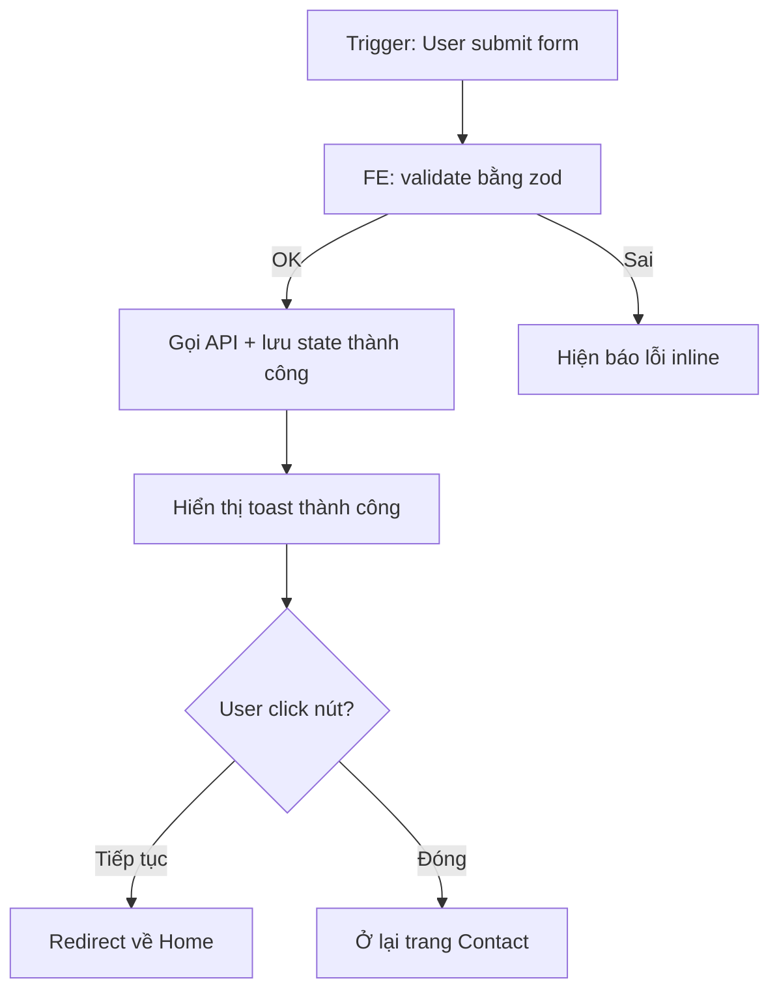

// turbo-all

# 📋 WORKFLOW: AUDIT LOGIC FEATURE

## Mục đích

Soi toàn bộ logic của 1 tính năng (đã code xong hoặc đang lên kế hoạch) để trả lời 5 câu hỏi:

1. **Logic ĐÃ CÓ** trong code: chính xác làm gì?
2. **Logic ĐANG CÓ** mà chưa hoàn thiện: chỗ nào dở dang, có TODO/FIXME, có placeholder?
3. **Logic CÒN THIẾU**: case/edge nào chưa xử lý? Use case nào User/Admin/Guest cần nhưng không có?
4. **Logic SAI/MẪU THUẪN**: có chỗ nào nghiệp vụ nói A nhưng code làm B không?
5. **Đề xuất bổ sung**: phương án cụ thể để bịt lỗ hổng — ưu tiên theo mức độ rủi ro.

**KHÁC** với `/5-audit-frontend` (chỉ UI):
- Audit-logic xét **toàn bộ pipeline** từ user action → logic xử lý → data lưu → output cho user
- Bao gồm cả frontend logic (state machine, validation), backend logic (compute, permission), data flow, edge cases
- KHÔNG đi sâu vào UI layout/CSS hay UX visual — đó là việc của `/5-audit-frontend`

---

## Điều kiện thất bại (KHÔNG được thiếu)

- Không liệt kê đủ actor (User/Admin/Guest/System/Cron)
- Không vẽ sơ đồ luồng nghiệp vụ
- Đề xuất chung chung, không chỉ rõ file/dòng/scope sửa
- Không phân loại mức độ rủi ro (CRITICAL/HIGH/MEDIUM/LOW)
- Bỏ qua edge cases (data null, race condition, status transition sai)
- Không kiểm tra logic ảnh hưởng chéo giữa các module

---

## CẤU TRÚC BẮT BUỘC CỦA BẢN AUDIT

### 1. Tổng quan tính năng

```
- Tên feature: [vd "Form Liên Hệ trang Contact"]
- Mục đích nghiệp vụ: [1-2 câu]
- Actors: [User / Admin / Guest / Cron / System]
- Status hiện tại: [Đã code xong / Đang code / Mới có plan / Có bug đang nghi ngờ]
- Files liên quan: [bot, webapp, data, mockup — list ngắn]
```

### 2. Sơ đồ luồng nghiệp vụ (Mermaid bắt buộc)

Vẽ flow tổng thể từ trigger ban đầu → kết thúc:



Đánh dấu rõ:
- **Trigger ban đầu** (slash command, webhook, cron, button click...)
- **Decision branches** (đánh dấu rõ điều kiện)
- **Side effects** (DM, save file, gọi API ngoài)
- **Terminal states** (kết thúc thành công vs lỗi)

### 3. Bảng liệt kê toàn bộ logic flows

| # | Flow | Loại | Actor | Logic mong đợi (từ business) | Logic thực tế (file:dòng) | Kết quả | Issue |
|---|---|---|---|---|---|---|---|
| 1 | Happy path full | Happy | HR | ... | service.js:45 | ✅ Khớp | — |
| 2 | Edge: status=X | Edge | HR | ... | api.js:120 | ⚠️ Khác | Thiếu validation |
| 3 | Concurrency: 2 user same time | Concurrency | HR×2 | ... | (không có) | ❌ Race | Cần lock |
| 4 | Cron auto vs HR manual | Concurrency | Cron+HR | ... | scheduler:30 | ⚠️ Cron đè HR | Cần check status |

**Loại flow:**
- `Happy` — đường đi bình thường khi mọi thứ đúng
- `Edge` — case ít gặp nhưng hợp lệ (vd NV inactive giữa tháng)
- `Error` — input/data sai, lỗi network, file corrupt
- `Concurrency` — 2 actor hành động cùng lúc
- `State transition` — chuyển status không hợp lệ (vd approved → draft)
- `Permission` — actor không đủ quyền nhưng vẫn gọi được API

### 4. Phân tích logic ĐÃ CÓ (ĐỌC CODE THỰC TẾ — không đoán)

Cho mỗi flow trong bảng → đọc code thực tế → trích dẫn:

```
✅ FLOW: [Tên flow]
📍 Vị trí: file.js:45-78
🔍 Logic đang làm:
  [Mô tả 3-5 dòng — KHÔNG copy code dài]
✓ Đúng nghiệp vụ vì: [lý do]
```

Hoặc:

```
❌ FLOW: [Tên flow]
📍 Vị trí: file.js:120
🔍 Logic đang làm:
  [Mô tả ngắn]
💥 Sai vì: [Khác business như thế nào]
🔗 Logic ảnh hưởng chéo: [Module nào khác bị ảnh hưởng]
```

### 5. Phân tích logic CÒN THIẾU

Liệt kê các case business RÕ RÀNG cần có nhưng KHÔNG tìm thấy trong code:

| # | Case bị thiếu | Tại sao cần | Hậu quả nếu không có | File nên thêm vào |
|---|---|---|---|---|
| 1 | Reset draft sau khi reject | HR sửa lại từ đầu | HR phải xoá file thủ công | api-server.js |
| 2 | Backup trước khi overwrite | An toàn data | Mất WIP khi vô tình đè | api-server.js |
| 3 | Notify CEO khi sheet stale | CEO quên duyệt | Trễ deadline lương | scheduler.js |

### 6. Phân tích logic SAI / MÂU THUẪN

| # | Mâu thuẫn | Business nói | Code làm | File:dòng | Tác động |
|---|---|---|---|---|---|
| 1 | Date format | dd-mm-yyyy | YYYY-MM-DD lưu | model.ts:42 | UX khó hiểu |
| 2 | Permission | HR có thể edit | API trả 403 cho HR | route.ts:28 | HR không làm việc được |

### 7. Edge cases CHECKLIST (theo loại module)

#### A. Data flow
- [ ] Field optional có default đúng chưa?
- [ ] Field bắt buộc có validate trước khi save không?
- [ ] Khi data null/undefined → có crash không?
- [ ] Khi field schema mới — data cũ chưa có field → handle thế nào?
- [ ] Migration có backward compat không?

#### B. State machine (status transitions)
- [ ] Vẽ được state transition diagram không?
- [ ] Mọi transition có check status hiện tại trước không?
- [ ] Có transition nào rollback được không (vd revert pending_ceo về draft)?
- [ ] Khi 2 transition cùng lúc → ai thắng?

#### C. Permission & Auth
- [ ] Mỗi action có check role không (HR/CEO/NV)?
- [ ] HMAC token có verify đúng signature không?
- [ ] Token expire có handle không?
- [ ] User KHÔNG có quyền vẫn gọi API → trả gì (403 hay 404)?
- [ ] Action read-only vs write — phân biệt permission rõ chưa?

#### D. Concurrency
- [ ] 2 HR cùng sửa 1 sheet → ai thắng (last-write-win)?
- [ ] Cron chạy lúc HR đang sửa → có conflict không?
- [ ] HR upload Excel khi CEO đang duyệt → block hay chấp nhận?
- [ ] Page load + edit cùng lúc → state có sync không?

#### E. External dependencies
- [ ] Backend API offline → FE có fail gracefully không (hiện toast lỗi thân thiện)?
- [ ] API ngoài timeout → có fallback không?
- [ ] Image CDN chết → có placeholder không?
- [ ] LocalStorage full → có handle không?

#### F. UX feedback
- [ ] Mọi action đều có loading indicator không?
- [ ] Success/error message có rõ ràng không?
- [ ] Action không hồi đáp 3s+ → user có thấy spinner?
- [ ] Lỗi nghiệp vụ vs lỗi kỹ thuật — phân biệt cho user không?

#### G. Audit trail
- [ ] Mọi thay đổi data có log ai sửa, lúc nào không?
- [ ] Có backup tự động trước khi đè không?
- [ ] Backup có rotate không (giữ N bản gần nhất)?
- [ ] Restore có quy trình rõ không?

---

### 8. Bảng đề xuất sửa đổi (BẮT BUỘC)

| # | Vấn đề | Loại | File/Module | Mức độ | Logic ảnh hưởng | Phương án A | Phương án B | Khuyến nghị |
|---|---|---|---|---|---|---|---|---|
| 1 | Race condition upload + cron | Concurrency | api-server.js | 🔴 CRITICAL | Mất WIP HR | Lock file | Check status trước | A |
| 2 | Thiếu reset endpoint | Missing | api-server.js | 🟡 HIGH | HR không reset được | Endpoint mới | Manual SSH | A |
| 3 | Date format inconsistent | Mâu thuẫn | UI + API | 🟢 MEDIUM | UX khó hiểu | Smart parse VN | Force ISO | A |

**Mức độ:**
- 🔴 **CRITICAL** — phá data hoặc nghiệp vụ → phải fix ngay trước khi release
- 🟡 **HIGH** — thiếu use case quan trọng → nên fix sprint hiện tại
- 🟢 **MEDIUM** — UX hoặc edge case ít gặp → có thể fix sau
- ⚪ **LOW** — nice-to-have → backlog

### 9. Phân loại ưu tiên xử lý

```
🔴 LÀM NGAY (trước demo / release):
- [#1] Race condition upload → 30 phút
- [#5] Permission HR bị block sai → 15 phút
Total: ~1h

🟡 SPRINT HIỆN TẠI:
- [#2] Reset endpoint → 1.5h
- [#7] Notify CEO stale → 1h
Total: ~2.5h

🟢 BACKLOG:
- [#3] Date format
- [#9] Audit trail rotation
```

### 10. Test plan sau khi fix (BẮT BUỘC)

```
Test 1 — [Tên scenario]
1. [Hành động cụ thể]
   → Kỳ vọng: [điều gì xảy ra]
2. [Hành động tiếp]
   → Kỳ vọng: ...
✅ Test PASS khi: [điều kiện rõ ràng]
```

---

## VÍ DỤ PHÂN TÍCH 1 LOGIC ISSUE CHUẨN

```
❌ ISSUE #4: Cron mùng 10 ghi đè draft đang HR sửa

📍 Vị trí: services/scheduler-hr.js:285-310

🔍 Logic hiện tại:
  Cron 09:00 mùng 10 hàng tháng tự gọi disciplineCompute.buildPrefillSheetForMonth(monthStr)
  → save trực tiếp xuống file ${monthStr}.json mà KHÔNG check existing.

💥 Hậu quả nghiệp vụ:
  - HR đã chuẩn bị sheet trước đó (trước mùng 10) → bị đè mất
  - Manual edits + comments + VHDN penalties → mất hết
  - Không có warning trên Discord cho HR

🔗 Logic ảnh hưởng chéo:
  - api-server.js /internal/discipline-upload đã check existing draft (Bug #1 fix)
  - commands/discipline.js đã check existing (Bug #1 fix)
  - NHƯNG cron BỎ qua check này → inconsistency

✅ Phương án A — Skip nếu có existing draft:
  if (existing && existing.status === 'draft' && existing.uploadedAt) {
    console.log('[cron] skip — HR đã có draft với data');
    return;
  }
  // Optional: DM HR "đã có draft, KHÔNG override"

✅ Phương án B — Merge prefill mới với draft cũ:
  Phức tạp hơn (preserve manual edits + apply prefill mới cho ô chưa edit).
  Để Phase 2.

🎯 Khuyến nghị: Phương án A — đơn giản, an toàn, đúng intent của Bug #1.

🧪 Test:
  1. HR đánh /discipline 2026-04 lúc mùng 5 → có draft
  2. HR sửa 5 ô → save
  3. Trigger cron giả (manual) lúc mùng 10
  4. Kỳ vọng: cron skip + log "đã có draft, không tạo lại"
  5. Mở sheet → 5 ô đã sửa VẪN CÒN
```

---

## GHI CHÚ VẬN HÀNH

- **Khi nào dùng workflow này**:
  - Trước khi release feature mới (audit toàn bộ logic 1 lần cuối)
  - Khi nghi ngờ feature hiện tại thiếu case (vd user complain mất data)
  - Khi nhận handover code từ người khác
  - Khi fix bug → audit để tìm bug tương tự ở chỗ khác

- **KHÔNG dùng cho**:
  - UI layout / CSS bugs → dùng `/5-audit-frontend`
  - Performance / latency → dùng `/7-optimize`
  - Security / auth deep dive → dùng `/5-security-frontend`

- **Sau khi audit xong**:
  - Lưu bản audit vào `docs/audit/<feature>-<date>.md`
  - KHÔNG tự sửa code trong lúc audit — chỉ ghi nhận + đề xuất
  - Báo Mr. Đào duyệt từng issue trước khi fix

- **Tỷ lệ vàng**: thời gian audit ≈ 30-50% thời gian implement feature đó. Nếu feature 1 tuần code → audit 2-3 ngày là hợp lý.
