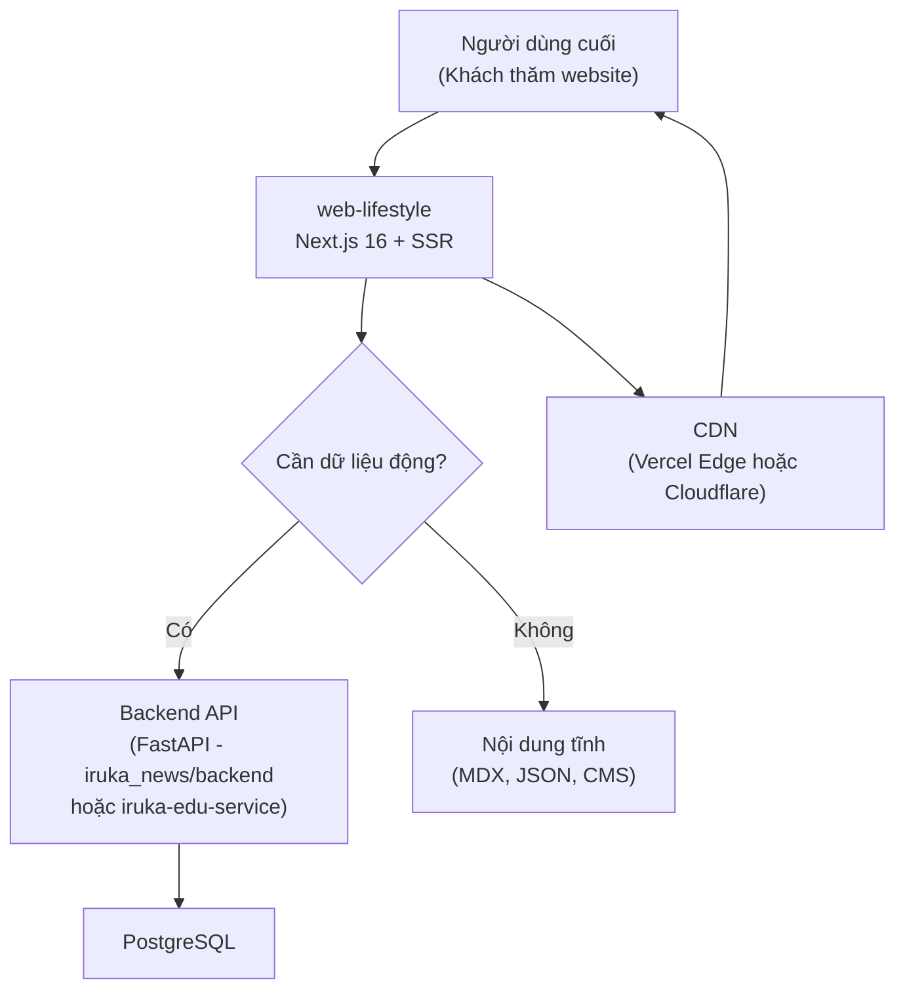
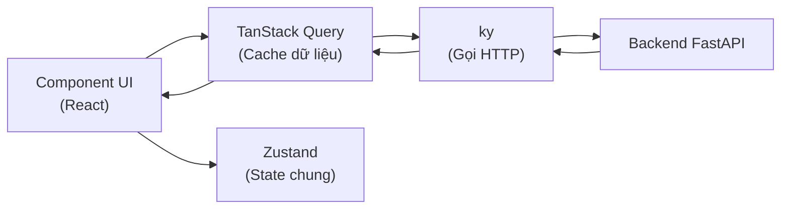

# 🌐 WEB LIFESTYLE — TECH STACK CHỐT CHO DEV FRONTEND

> **Phiên bản:** v1.0 | **Cập nhật:** 2026-05-16 | **Người chốt:** Mr. Đào (IruKa)
>
> **Mục đích:** Đây là tài liệu **bắt buộc đọc** trước khi bắt đầu code website công ty. Mọi quyết định công nghệ trong file này đã được chốt để **đồng bộ 100%** với hệ sinh thái IruKa (đặc biệt là `iruka-app` và `iruka_news`). Dev **KHÔNG được tự ý đổi công nghệ** mà không hỏi.

---

## 📑 Mục lục

1. [Bối cảnh & Mục tiêu](#1-bối-cảnh--mục-tiêu)
2. [Tech Stack chính (Chốt)](#2-tech-stack-chính-chốt)
3. [Kiến trúc tổng quan](#3-kiến-trúc-tổng-quan)
4. [Cấu trúc thư mục chuẩn](#4-cấu-trúc-thư-mục-chuẩn)
5. [Quy tắc Code (Convention)](#5-quy-tắc-code-convention)
6. [Quy tắc UI/UX](#6-quy-tắc-uiux)
7. [Setup dự án từ A-Z](#7-setup-dự-án-từ-a-z)
8. [Deploy](#8-deploy)
9. [Quy tắc Git & PR](#9-quy-tắc-git--pr)
10. [Checklist nghiệm thu](#10-checklist-nghiệm-thu)

---

## 1. Bối cảnh & Mục tiêu

### 1.1 Đây là gì?

`web-lifestyle` là **website công ty** (corporate website — trang giới thiệu công ty, dịch vụ, tin tức, liên hệ) thuộc hệ sinh thái IruKa Edu.

### 1.2 Mục tiêu

- ✅ **Đồng bộ công nghệ** với 2 dự án anh em: `iruka-app` (app phụ huynh/học sinh) + `iruka_news` (hệ tin tức)
- ✅ **SEO tốt** — Vì là website công ty, phải lên top Google
- ✅ **Tải nhanh** — Mục tiêu LCP (thời gian hiện nội dung chính) < 2.5s, FCP (thời gian khung sườn xuất hiện) < 1.5s
- ✅ **Responsive đa thiết bị** — Mobile (393×852), Tablet (820×1180), Desktop (1440×900)
- ✅ **Đẹp & chuyên nghiệp** — Có animation mượt, micro-interaction (tương tác nhỏ khi hover/click)

### 1.3 Không phải là gì?

- ❌ Không phải SPA (Single Page App — app 1 trang) → **PHẢI dùng Server-Side Rendering** (render sẵn ở server cho Google crawl tốt)
- ❌ Không phải dashboard quản trị → Stack này **chỉ áp dụng cho website công khai**
- ❌ Không cần authentication (đăng nhập) phức tạp — chỉ cần form liên hệ

---

## 2. Tech Stack chính (Chốt)

### 2.1 ⚙️ Core Framework — KHÔNG ĐƯỢC ĐỔI

| Mục | Công nghệ | Phiên bản | Lý do chọn |
|---|---|---|---|
| **Framework** | [Next.js](https://nextjs.org/) (khung web chính, chạy cả server lẫn UI) | **16.1.x** | Đồng bộ với `iruka_news`. Có App Router, Server Components, SEO tốt |
| **Thư viện UI** | [React](https://react.dev/) (xây dựng giao diện) | **19.2.x** | Bản mới nhất, hỗ trợ Server Components |
| **Ngôn ngữ** | [TypeScript](https://www.typescriptlang.org/) (JavaScript có kiểm tra kiểu dữ liệu nghiêm ngặt) | **^5.0** | Chuẩn IruKa, **strict mode** bắt buộc — không dùng `any` |
| **Node.js** | Runtime chạy Next.js | **>= 20** | Đồng bộ với `iruka-app` |
| **Package Manager** | [pnpm](https://pnpm.io/) (trình cài thư viện, nhanh hơn npm) | **>= 9** | Đồng bộ với `iruka_news/admin` (có `pnpm-lock.yaml`) |

### 2.2 🎨 Styling & UI — KHÔNG ĐƯỢC ĐỔI

| Mục | Công nghệ | Phiên bản | Lý do |
|---|---|---|---|
| **CSS Framework** | [TailwindCSS](https://tailwindcss.com/) v4 (viết style ngắn gọn bằng class) | **^4.1** | Đồng bộ toàn hệ |
| **PostCSS** | `@tailwindcss/postcss` (xử lý CSS) | **^4** | Bắt buộc khi dùng Tailwind v4 |
| **Tiện ích class** | `clsx` + `tailwind-merge` (gộp class CSS thông minh) | latest | Tránh xung đột class Tailwind |
| **Component primitives** | [Radix UI](https://www.radix-ui.com/) (Dialog, Dropdown, Tabs... đã chuẩn accessibility) | latest | **Dùng khi cần component phức tạp** (modal, dropdown, tooltip). Bỏ qua nếu chỉ cần button/input đơn giản |
| **Variant style** | `class-variance-authority` (cva — tạo variant cho component) | ^0.7 | Pattern shadcn — sạch, dễ maintain |

### 2.3 🔄 State Management & Data Fetching

| Mục | Công nghệ | Phiên bản | Khi nào dùng |
|---|---|---|---|
| **Global State** | [Zustand](https://github.com/pmndrs/zustand) (kho lưu trạng thái chung, nhẹ) | **^5.0** | Khi cần share state giữa nhiều màn hình (theme, user info, cart...) |
| **Server State** | [TanStack Query](https://tanstack.com/query) (quản lý cache dữ liệu từ API) | **^5.90** | Khi gọi API có nhiều màn hình dùng chung (tin tức, danh sách dịch vụ...) |
| **HTTP Client** | [ky](https://github.com/sindresorhus/ky) (thư viện gọi API ngắn gọn, fetch wrapper) | **^1.14** | **BẮT BUỘC** dùng ky — KHÔNG dùng axios, KHÔNG dùng fetch thuần |

### 2.4 📝 Forms & Validation

| Mục | Công nghệ | Phiên bản |
|---|---|---|
| **Form** | [react-hook-form](https://react-hook-form.com/) (quản lý form hiệu năng cao) | **^7.71** |
| **Validation** | [zod](https://zod.dev/) (kiểm tra dữ liệu theo schema) | **^4.x** |
| **Adapter** | `@hookform/resolvers` (cầu nối zod ↔ react-hook-form) | **^5.x** |

### 2.5 ✨ Animation & Icon

| Mục | Công nghệ | Phiên bản | Khi nào dùng |
|---|---|---|---|
| **Animation** | [framer-motion](https://www.framer.com/motion/) (hiệu ứng chuyển động mượt) | **^12.x** | Hero section, fade-in khi scroll, micro-interaction |
| **Icon** | [lucide-react](https://lucide.dev/) (bộ icon SVG hiện đại) | **^0.555+** | **DUY NHẤT** — KHÔNG dùng react-icons, KHÔNG dùng Heroicons |

### 2.6 🔔 Notification & Tiện ích khác

| Mục | Công nghệ | Phiên bản |
|---|---|---|
| **Toast (thông báo nổi)** | [sonner](https://sonner.emilkowal.ski/) | **^2.0** |
| **Cookie** | `js-cookie` | **^3.0** |
| **Debounce** | `use-debounce` (chống gọi liên tục) | **^10.x** |

### 2.7 🧪 Dev Tools

| Mục | Công nghệ | Phiên bản |
|---|---|---|
| **ESLint** (bắt lỗi code) | `eslint` + `eslint-config-next` | **^9** / 16.x |
| **Mock API** (giả backend khi dev) | [MSW](https://mswjs.io/) (Mock Service Worker) | **^2.13** |
| **Clean** | `rimraf` (xóa thư mục đa nền tảng) | **^6** |

### 2.8 ❌ KHÔNG DÙNG (tránh nhầm)

```
❌ Pages Router (Next.js cũ)         → Dùng App Router (Next.js 13+)
❌ CSS Modules / Styled Components   → Dùng TailwindCSS v4
❌ Redux / MobX / Recoil             → Dùng Zustand
❌ Axios / SWR / Fetch thuần         → Dùng ky + TanStack Query
❌ Material UI / Ant Design          → Dùng Radix UI + cva (shadcn pattern)
❌ React Icons / Heroicons / FontAwesome → Dùng lucide-react
❌ Yup / Joi                         → Dùng zod
❌ Formik                            → Dùng react-hook-form
❌ JavaScript thuần                  → BẮT BUỘC TypeScript strict
❌ npm / yarn                        → Dùng pnpm
```

---

## 3. Kiến trúc tổng quan

### 3.1 Sơ đồ kết nối với hệ sinh thái IruKa



### 3.2 Sơ đồ luồng dữ liệu



### 3.3 Server Components vs Client Components

> **Quy tắc vàng:** Mặc định là **Server Component** — chỉ dùng `'use client'` khi BẮT BUỘC.

| Loại | Khi nào dùng | Ví dụ |
|---|---|---|
| **Server Component** (mặc định) | Hiển thị nội dung tĩnh, SEO quan trọng, fetch data từ DB | Trang Giới thiệu, Trang Tin tức (list), Footer |
| **Client Component** (`'use client'`) | Có tương tác người dùng (state, click, animation, useEffect) | Form liên hệ, Menu mobile (toggle), Carousel, Modal |

---

## 4. Cấu trúc thư mục chuẩn

```
web-lifestyle/
├── README.md
├── TECH_STACK.md              ← File này
├── package.json
├── pnpm-lock.yaml
├── next.config.ts
├── tsconfig.json
├── postcss.config.mjs
├── eslint.config.mjs
├── .env.local                 ← Biến môi trường (KHÔNG commit)
├── .env.example               ← Mẫu .env (CÓ commit)
├── .gitignore
│
├── public/                    ← File tĩnh (ảnh, font, favicon)
│   ├── images/
│   ├── fonts/
│   └── favicon.ico
│
└── src/
    ├── app/                   ← App Router (Next.js 13+)
    │   ├── layout.tsx         ← Root layout (header + footer chung)
    │   ├── page.tsx           ← Trang chủ /
    │   ├── globals.css        ← CSS chung + Tailwind directives
    │   ├── (marketing)/       ← Route group cho marketing pages
    │   │   ├── about/page.tsx
    │   │   ├── services/page.tsx
    │   │   └── contact/page.tsx
    │   ├── blog/
    │   │   ├── page.tsx
    │   │   └── [slug]/page.tsx
    │   └── api/               ← API routes (nếu cần)
    │
    ├── components/
    │   ├── ui/                ← Component nguyên thuỷ (Button, Input, Card)
    │   ├── layout/            ← Header, Footer, Sidebar
    │   ├── sections/          ← Section riêng cho trang (Hero, Features, CTA)
    │   └── shared/            ← Component dùng chung (Logo, ThemeToggle)
    │
    ├── lib/
    │   ├── api/               ← Client gọi API (ky instance)
    │   │   ├── client.ts
    │   │   └── endpoints.ts
    │   ├── utils.ts           ← Hàm tiện ích (cn, formatDate...)
    │   └── constants.ts       ← Hằng số (SITE_NAME, EMAIL...)
    │
    ├── hooks/                 ← Custom hooks (useDebounce, useMediaQuery)
    │
    ├── stores/                ← Zustand stores
    │   └── ui-store.ts        ← Trạng thái UI chung (theme, modal...)
    │
    ├── types/                 ← TypeScript types
    │   ├── api.ts
    │   └── domain.ts
    │
    └── styles/                ← (Optional) CSS bổ sung nếu cần
```

---

## 5. Quy tắc Code (Convention)

### 5.1 Đặt tên file

```
✅ ĐÚNG:
- Component:        Button.tsx, ContactForm.tsx, HeroSection.tsx (PascalCase)
- Hook:             useDebounce.ts, useMediaQuery.ts (camelCase với prefix "use")
- Util/Lib:         format-date.ts, api-client.ts (kebab-case)
- Page (Next.js):   page.tsx, layout.tsx (theo chuẩn Next.js)
- Store (Zustand):  ui-store.ts, user-store.ts (kebab-case)
- Type:             api.ts, domain.ts (kebab-case)

❌ SAI:
- button.tsx, contact_form.tsx, HeroSection.jsx
```

### 5.2 Đặt tên biến/hàm

```typescript
// ✅ ĐÚNG
const userName = 'Đào';                    // camelCase
const MAX_RETRY_COUNT = 3;                 // CONSTANT_CASE cho hằng số
function fetchUserById(id: string) {}      // camelCase + động từ + danh từ
interface UserProfile {}                   // PascalCase cho type/interface
type ApiResponse<T> = { data: T };         // PascalCase

// ❌ SAI
const user_name = 'Đào';                   // snake_case
const maxRetryCount = 3;                   // hằng số phải UPPER
function user(id: string) {}               // tên hàm không rõ
```

### 5.3 Header file BẮT BUỘC

Mỗi file phải có comment header **bằng tiếng Việt** nêu 3 thứ — **Luồng nào / Vai trò gì / Khi nào dùng**:

```typescript
// File: ContactForm.tsx
// Luồng: Trang liên hệ (/contact)
// Vai trò: Component form thu thập thông tin khách hàng (tên, email, lời nhắn),
//          validate dữ liệu bằng zod, gửi lên backend qua POST /api/contact,
//          hiện toast báo thành công hoặc lỗi.
// Dùng khi: Khách bấm "Liên hệ với chúng tôi" và điền form gửi yêu cầu.

'use client';

import { useForm } from 'react-hook-form';
// ...
```

### 5.4 Comment trong code

```typescript
// ✅ ĐÚNG — Comment đầy đủ ý, tiếng Việt:
// Kiểm tra email người dùng nhập có đúng định dạng không,
// sai thì hiện báo lỗi đỏ dưới ô email
const isValidEmail = /^[^\s@]+@[^\s@]+\.[^\s@]+$/.test(email);

// ❌ SAI — Comment cụt, tiếng Anh:
// validate email
const isValidEmail = /^[^\s@]+@[^\s@]+\.[^\s@]+$/.test(email);
```

### 5.5 TypeScript Strict — KHÔNG dùng `any`

```typescript
// ✅ ĐÚNG
function getUser(id: string): Promise<User | null> { /* ... */ }

interface ApiError {
  code: number;
  message: string;
}

// ❌ SAI
function getUser(id: any): any { /* ... */ }    // Tuyệt đối cấm
```

### 5.6 Component pattern chuẩn

```typescript
// File: components/ui/Button.tsx
// Luồng: Hệ thống design — component nút bấm dùng toàn app
// Vai trò: Render nút bấm với nhiều variant (primary, secondary, ghost) và size (sm, md, lg)
// Dùng khi: Cần 1 nút bấm bất kỳ trong giao diện

import { cva, type VariantProps } from 'class-variance-authority';
import { cn } from '@/lib/utils';
import { forwardRef } from 'react';

const buttonVariants = cva(
  'inline-flex items-center justify-center rounded-md font-medium transition-colors',
  {
    variants: {
      variant: {
        primary: 'bg-blue-600 text-white hover:bg-blue-700',
        secondary: 'bg-gray-200 text-gray-900 hover:bg-gray-300',
        ghost: 'hover:bg-gray-100',
      },
      size: {
        sm: 'h-8 px-3 text-sm',
        md: 'h-10 px-4 text-base',
        lg: 'h-12 px-6 text-lg',
      },
    },
    defaultVariants: { variant: 'primary', size: 'md' },
  }
);

interface ButtonProps
  extends React.ButtonHTMLAttributes<HTMLButtonElement>,
    VariantProps<typeof buttonVariants> {}

export const Button = forwardRef<HTMLButtonElement, ButtonProps>(
  ({ className, variant, size, ...props }, ref) => {
    return (
      <button
        ref={ref}
        className={cn(buttonVariants({ variant, size }), className)}
        {...props}
      />
    );
  }
);
Button.displayName = 'Button';
```

### 5.7 ky API client pattern

```typescript
// File: src/lib/api/client.ts
// Luồng: Toàn hệ thống — instance ky gốc để gọi backend
// Vai trò: Tạo 1 ky instance có sẵn baseURL, header Authorization, timeout, retry
// Dùng khi: Bất kỳ chỗ nào cần gọi API backend

import ky from 'ky';

export const apiClient = ky.create({
  prefixUrl: process.env.NEXT_PUBLIC_API_URL,
  timeout: 10000,
  retry: { limit: 2 },
  hooks: {
    beforeRequest: [
      (request) => {
        // Tự động gắn token nếu có
        const token = typeof window !== 'undefined' ? localStorage.getItem('token') : null;
        if (token) request.headers.set('Authorization', `Bearer ${token}`);
      },
    ],
  },
});
```

---

## 6. Quy tắc UI/UX

### 6.1 Responsive Breakpoint (BẮT BUỘC test 3 cỡ)

```
📱 Mobile:  393×852  (iPhone 14 Pro)
📱 Tablet:  820×1180 (iPad)
💻 Desktop: 1440×900 (MacBook)
```

Tailwind breakpoint mặc định:
```
sm:  640px   md:  768px   lg:  1024px   xl:  1280px   2xl: 1536px
```

### 6.2 Color Palette

Định nghĩa trong `globals.css` bằng CSS variables để dễ đổi theme:

```css
@theme {
  --color-brand-primary:   #2563eb;
  --color-brand-secondary: #f59e0b;
  --color-text-primary:    #111827;
  --color-text-secondary:  #6b7280;
  --color-bg-base:         #ffffff;
  --color-bg-subtle:       #f9fafb;
}
```

### 6.3 Typography

- **Font chính:** Inter (Latin) hoặc Be Vietnam Pro (hỗ trợ tiếng Việt tốt)
- **Heading scale:** `text-3xl` (h1) → `text-2xl` (h2) → `text-xl` (h3) → `text-base` (body)
- **Line height:** `leading-relaxed` cho đoạn văn dài

### 6.4 Animation

- **Page transition:** dùng `framer-motion` với `AnimatePresence`
- **Scroll reveal:** `whileInView` với `viewport={{ once: true }}` để chỉ animate 1 lần
- **Micro-interaction:** hover scale 1.02, transition 200ms
- **❌ KHÔNG dùng** animation lòe loẹt, chớp tắt, nhảy nhót — phải mượt mà chuyên nghiệp

### 6.5 Accessibility (A11Y — khả năng truy cập cho người khuyết tật)

- ✅ Mọi `` phải có `alt`
- ✅ Mọi `<button>` không có text phải có `aria-label`
- ✅ Tab navigation phải hoạt động (test bằng phím Tab)
- ✅ Contrast ratio (độ tương phản màu) tối thiểu 4.5:1 cho text

### 6.6 SEO

- ✅ Mỗi page phải có `metadata` export (title, description, OG image)
- ✅ Dùng `<h1>` duy nhất 1 lần / page
- ✅ URL slug ngắn gọn, có dấu gạch ngang: `/dich-vu/giao-duc-tre-em` (không phải `/dich_vu` hay `/dichvu`)
- ✅ Sitemap.xml + robots.txt
- ✅ Open Graph image cho mỗi page chính

---

## 7. Setup dự án từ A-Z

### 7.1 Khởi tạo lần đầu

```bash
# 1. Tạo dự án Next.js 16 với TypeScript + Tailwind
cd /Users/user/Desktop/work-space/cong-nghe/web-lifestyle
pnpm create next-app@latest . \
  --typescript \
  --tailwind \
  --app \
  --src-dir \
  --import-alias "@/*" \
  --no-eslint

# 2. Cài thư viện chính (đồng bộ phiên bản)
pnpm add \
  zustand@^5.0 \
  @tanstack/react-query@^5.90 \
  ky@^1.14 \
  react-hook-form@^7.71 \
  zod@^4 \
  @hookform/resolvers@^5 \
  framer-motion@^12 \
  lucide-react@^0.562 \
  sonner@^2 \
  clsx \
  tailwind-merge \
  class-variance-authority \
  js-cookie \
  use-debounce

# 3. Cài Radix UI primitives cần dùng (chọn theo nhu cầu)
pnpm add \
  @radix-ui/react-dialog \
  @radix-ui/react-dropdown-menu \
  @radix-ui/react-tabs \
  @radix-ui/react-toast \
  @radix-ui/react-slot

# 4. Cài dev dependencies
pnpm add -D \
  @types/js-cookie \
  msw \
  rimraf \
  eslint@^9 \
  eslint-config-next
```

### 7.2 File cấu hình chuẩn

#### `next.config.ts`
```typescript
import type { NextConfig } from 'next';

const nextConfig: NextConfig = {
  reactStrictMode: true,
  poweredByHeader: false,
  output: 'standalone',  // Bắt buộc cho Docker deploy

  images: {
    remotePatterns: [
      { protocol: 'https', hostname: 'storage.googleapis.com' },
    ],
  },

  experimental: {
    optimizePackageImports: ['lucide-react'],
  },
};

export default nextConfig;
```

#### `tsconfig.json`
```json
{
  "compilerOptions": {
    "target": "ES2020",
    "lib": ["dom", "dom.iterable", "esnext"],
    "allowJs": true,
    "skipLibCheck": true,
    "strict": true,
    "noEmit": true,
    "esModuleInterop": true,
    "module": "esnext",
    "moduleResolution": "bundler",
    "resolveJsonModule": true,
    "isolatedModules": true,
    "jsx": "preserve",
    "incremental": true,
    "plugins": [{ "name": "next" }],
    "baseUrl": ".",
    "paths": { "@/*": ["./src/*"] }
  },
  "include": ["next-env.d.ts", "**/*.ts", "**/*.tsx", ".next/types/**/*.ts"],
  "exclude": ["node_modules"]
}
```

#### `.env.example`
```bash
# URL backend API (FastAPI)
NEXT_PUBLIC_API_URL=https://api.iruka.edu.vn

# Google Analytics (nếu có)
NEXT_PUBLIC_GA_ID=G-XXXXXXXXXX

# Site
NEXT_PUBLIC_SITE_URL=https://lifestyle.iruka.edu.vn
NEXT_PUBLIC_SITE_NAME=IruKa Lifestyle
```

### 7.3 Lệnh dev hàng ngày

```bash
pnpm dev          # Chạy dev server (port 3000 mặc định, hoặc đổi trong package.json)
pnpm build        # Build production
pnpm start        # Chạy production build
pnpm lint         # Check lỗi code
pnpm lint:fix     # Tự fix lỗi format
pnpm clean        # Xóa .next + out
```

### 7.4 Port quy ước (tránh trùng với app khác)

```
iruka-app:           3003
iruka_news/admin:    3001 (hoặc tự config)
iruka_news/guest:    3000
web-lifestyle:       3005  ← Đề xuất port này, tránh trùng
```

Sửa trong `package.json`:
```json
"scripts": {
  "dev": "next dev -p 3005"
}
```

---

## 8. Deploy

### 8.1 Production target

| Môi trường | Hosting | Lý do |
|---|---|---|
| **Production** | **Vercel** (miễn phí tier hobby, deploy Next.js cực mượt) | Auto deploy từ GitHub, có Edge CDN |
| **Backup option** | **Docker → GCP Cloud Run** | Khi cần kiểm soát hạ tầng |

### 8.2 Domain quy ước

- Production: `lifestyle.iruka.edu.vn` (hoặc domain do Mr. Đào chốt)
- Staging: `staging.lifestyle.iruka.edu.vn`

### 8.3 Build artifact

Vì `output: 'standalone'`, sau khi `pnpm build`:
- Server bundle: `.next/standalone/server.js`
- Static assets: `.next/static/`
- Public files: `public/`

---

## 9. Quy tắc Git & PR

### 9.1 Branch naming

```
main                           ← Branch chính, deploy production
develop                        ← Branch tích hợp (nếu cần)
feat/contact-form              ← Tính năng mới
fix/header-mobile-overflow     ← Sửa bug
chore/update-deps              ← Việc lặt vặt
docs/update-readme             ← Tài liệu
refactor/extract-hero          ← Refactor (sắp xếp lại code)
```

### 9.2 Commit message — Conventional Commits

```
✅ ĐÚNG:
feat: thêm form liên hệ ở trang Contact
fix: sửa lỗi menu mobile không đóng khi click outside
chore: cập nhật Next.js 16.1.4 → 16.1.6
docs: bổ sung hướng dẫn deploy lên Vercel
refactor: tách HeroSection ra component riêng
style: format lại file Button.tsx theo prettier

❌ SAI:
update                  ← Quá cụt
fix bug                 ← Bug nào?
WIP                     ← Không bao giờ commit WIP lên branch chính
sửa lỗi                ← Lỗi gì?
```

### 9.3 Quy tắc PR (Pull Request — đề nghị merge code)

Mỗi PR phải có:
- ✅ Title rõ ràng: `[feat] Form liên hệ — Contact page`
- ✅ Mô tả: làm gì, tại sao, ảnh hưởng đến đâu
- ✅ Screenshot/video demo (nếu là UI)
- ✅ Checklist test: đã test mobile/tablet/desktop chưa
- ✅ Tối đa 500 dòng diff / PR (PR quá to khó review)

---

## 10. Checklist nghiệm thu

Trước khi dev bàn giao 1 trang, phải tick đủ:

### 10.1 Code Quality

- [ ] Không còn `console.log` debug
- [ ] Không còn `// TODO` chưa xử lý
- [ ] Không có `any` trong TypeScript
- [ ] `pnpm lint` pass 0 lỗi
- [ ] `pnpm build` thành công, không warning
- [ ] Tên file/biến/hàm đúng convention
- [ ] Header file đã có 3 dòng (Luồng/Vai trò/Khi nào dùng)
- [ ] Comment logic phức tạp bằng tiếng Việt đầy đủ ý

### 10.2 UI/UX

- [ ] Đẹp đúng 100% mockup ở 3 cỡ màn (mobile/tablet/desktop)
- [ ] Animation mượt, không giật
- [ ] Hover/click có feedback rõ ràng
- [ ] Form validate đầy đủ, hiện lỗi rõ
- [ ] Loading state có skeleton (khung xương xám) hoặc spinner
- [ ] Error state có thông báo thân thiện (không hiện trace lỗi kỹ thuật)
- [ ] Empty state có hình + dòng chữ hướng dẫn

### 10.3 SEO & Performance

- [ ] Mỗi page có `metadata` đầy đủ (title, description, OG image)
- [ ] Lighthouse score: Performance >= 90, SEO >= 95, Accessibility >= 90
- [ ] LCP < 2.5s, CLS < 0.1
- [ ] Ảnh dùng `next/image` (tự optimize), không dùng `` thuần
- [ ] Font dùng `next/font` (tránh layout shift)

### 10.4 A11Y (Accessibility)

- [ ] Tab navigation đi đúng thứ tự
- [ ] Mọi `` có `alt`
- [ ] Mọi `<button>` icon-only có `aria-label`
- [ ] Contrast text/background >= 4.5:1
- [ ] Form input có `<label>` đúng cách

### 10.5 Browser/Device test

- [ ] Chrome desktop ✅
- [ ] Safari desktop ✅
- [ ] Firefox desktop ✅
- [ ] Safari iPhone ✅
- [ ] Chrome Android ✅

---

## 📌 TÓM TẮT 1 PHÚT — CHỐT NGAY

```
✅ Next.js 16 + React 19 + TypeScript 5 strict
✅ TailwindCSS v4 + Radix UI + cva (shadcn pattern)
✅ Zustand + TanStack Query + ky
✅ react-hook-form + zod
✅ framer-motion + lucide-react + sonner
✅ pnpm + ESLint + MSW
✅ App Router + Server Components mặc định
✅ Deploy: Vercel (chính) / Docker GCP Cloud Run (backup)
✅ Port dev: 3005
✅ Node >= 20
```

---

## 🚨 NGUYÊN TẮC VÀNG CHO DEV

1. **KHÔNG tự ý đổi công nghệ** — Mọi thư viện ngoài danh sách này phải hỏi Mr. Đào trước
2. **KHÔNG dùng `any`** trong TypeScript — Strict 100%
3. **KHÔNG hardcode** URL, API key, mật khẩu — Dùng `.env.local`
4. **KHÔNG commit** file `.env.local`, `node_modules`, `.next`
5. **KHÔNG copy-paste** code — Tách thành component/hook tái sử dụng
6. **LUÔN test 3 cỡ màn** trước khi báo xong
7. **LUÔN viết header file** 3 dòng (Luồng/Vai trò/Khi nào dùng) bằng tiếng Việt
8. **LUÔN ưu tiên Server Component** — Chỉ dùng `'use client'` khi cần state/effect

---

## 📞 Liên hệ khi vướng

- **Chủ dự án:** Mr. Đào (CEO IruKa)
- **Tham khảo code mẫu:** `iruka_news/guest/` và `iruka-app/` (cùng workspace)
- **Tham khảo CLAUDE.md gốc:** `/Users/user/Desktop/work-space/cong-nghe/GEMINI.md`

---

_Tài liệu này là **nguồn sự thật duy nhất** (single source of truth) về tech stack của web-lifestyle. Mọi sai khác với tài liệu này = bug._
